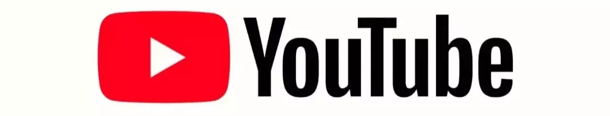

# DICAS EM 3 MINUTOS
Conteúdo programático para nova série do youtube

## Javascript & EcmaScript
 - Definição de variáveis
 - Diferentes tipos de variáveis (var, let, const)
 - Tipos de dados
 - Operadores lógicos
 - Funções
 - Métodos de array
 - Funções arrow
 - Classes
 - Promises
 - Métodos Math
 - Rest parameters (...)

## Metaprogramação
 - Proxy
 - Objeto
 - Decorators

## Design Patterns 
- ...

## Básico de NPM (package.json)
 - Semântica de versionamento
 - Versão
 - Engine
 - Scripts
 - Repositório

## NodeJS
 - Event Emitter
 - Buffers
 - Module System (import, export, require)
 - Leitura de arquivos
 - Stream

## Arquitetura
 - Arquitetura limpa
 - MVC

## Tempo Real
 - Socket.io

## HTTP/HTTPS protocols
 - Cliente/Servidor
 - Verbos Http GET, POST, DELETE, PUT, PATCH

## GIT
 - ...

## Web Frameworks
 - Express ...

## Database
 - PostgresSQL
 - MongoDb
 - Redis

## Gerenciamento de logs
 - Sentry.io
 - Node Log

## Testes
 - Jest
 - Sinon
 - Supertest

## View Engine
 - EJS
 - Mustache

## Solid
 - ...

## Clean Code
 - Boa nomenclatura para variáveis, funções, classes e métodos
 - Deixar o código sempre mais limpo
 - Funções pequenas, úteis e com responsabilidade clara
 - Código sem repetição
 - Comentário apenas quando estritamente necessário
 - Tratamento de erros
 - Testes limpos
